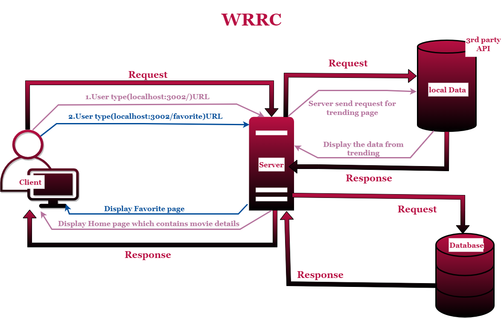

# Movies-Library -Version 3

# ***Author Name***: ***Rama Wael***

# WRRC
## The web request response cicle for this website:

# Overview
This website brovides movies names with details for each movie in the home page   
and it's also provide some info from (The Moviedb) website about movies and actors and others
# Getting Started
<!-- What are the steps that a user must take in order to build this app on their own machine and get it running? -->
## If you want to run this app in your machine follow this steps:
1.Clone the repository in your console(git clone(ssh link))  
2.Open it with VScode (code .)  
3.in order to make your code run you have to install somethings in the console  
-npm i express cors axios dotenv   
then you will see them in package.json file   
4.To run this project in your browser type (npm start) then 
   go to the browser and type this URL(localhost:3002)=>3002 is the PORT number check it in the code.  
5.After every change (ctrl+c) then rewrite (npm start) and refresh to get results

# Project Features
Ok, for today i started to create database and I have added some info about my favourite movie to it
-First I added function addMovies to add the movie and it's details 
-then I added getMovies function to get that movie that i added
<!-- for today I added a lot of pages   
1. I added functions to moves you to several pages like:  
a. function with path "/" that display home page which provide some info from (data.json file)//it's from the previous lab  
b.also favorite page that displays favorite page with path "/favorite"  
c. I added trending page with path"/trending" that display trending movies for the week (brings data from API from (The Moviedb) website)  
d. I also added search page   
e. I added genres page that display type of movies in general and another page to display one of my favorite actors info (favActor page) -->
<!-- -I added "/" this path which move you to the home that display some details about the movies  
-also I added "/favorite" this path that moves you to favorite page which display the favorite movies   
-I added 404 status to handle (page not found) errors and another 500 status to handle server errors  -->
<!-- What are the features included in you app -->