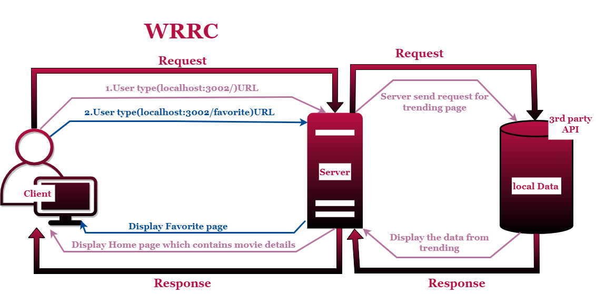

# Movies-Library -Version 1

# ***Author Name***: ***Rama Wael***

# WRRC
## The web request response cicle for this website:

# Overview
This website brovides movies names with details for each movie 
# Getting Started
<!-- What are the steps that a user must take in order to build this app on their own machine and get it running? -->
## If you want to run this app in your machine follow this steps:
1.Clone the repository in your console(git clone(ssh link))  
2.Open it with VScode (code .)  
3.To run this project in your browser type (npm start) then 
   go to the browser and type this URL(localhost:3002)=>3002 is the PORT number check it in the code.  
4.After every change (ctrl+c) then rewrite (npm start) and refresh to get results

# Project Features
-I added "/" this path which move you to the home that display some details about the movies  
-also I added "/favorite" this path that moves you to favorite page which display the favorite movies   
-I added 404 status to handle (page not found) errors and another 500 status to handle server errors 
<!-- What are the features included in you app -->